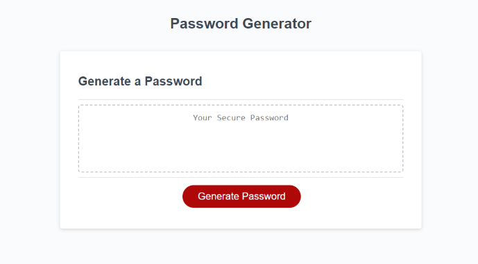

# <Random Password >

## Description

I wrote this JavaScript fucntion to generate a random password based on a series of user prompts. I learned how to incorporate alerts, confirms, and prompts into my HTML applications through JavaScript, as well as how to modify arrays and strings through a variety of methods and functions. 

## Installation

N/A

## Usage

1. Access the website at the provided URL: 

2. Click on "Generate Password": 

3. Answer the prompts asking for password length, whether to include uppercase letters, numbers, and/or special characters.

4. Copy the generated password to your Clipboard for further use:

## Credits

Collaborator(s):

Dallas Sybrowsky: https://github.com/DallasSybrowsky

## License

N/A